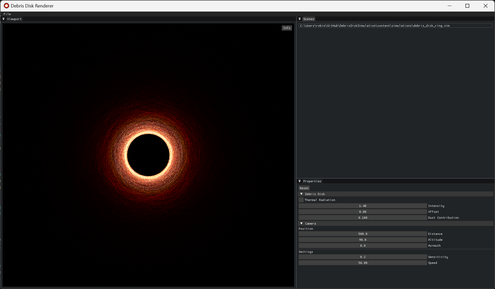

# Debris Disk Renderer

A high-performance, real-time visualization tool for simulating and analyzing debris disks around exoplanetary systems. Built with modern graphics techniques to enable interactive exploration of disk morphologies.

 
<i>The tool window</i>

## Features

- **Real-time 3D Rendering**: Interactive visualization of debris disk morphologies with dynamic camera controls
- **Dual Rendering Modes**: Support for both scattered light and thermal emission visualization
- **High-Performance Particle System**: Efficient rendering of millions of dust particles using GPU acceleration
- **Scientific Accuracy**: Implementation of Lee & Chiang (2016) model for accurate debris disk simulation
- **Interactive Analysis**: Real-time parameter adjustment for studying disk properties
- **Export Capabilities**: High-resolution image export for scientific documentation

<table>
<tr>
<td align="center"> <i>Various debris disks in scattered light</i></td>
<td align="center"> <i>Various debris disks in thermal emission</i></td>
</tr>
</table>

## Quick Start

### Download
Latest Windows Release: [v1.0.0](https://github.com/robinlmn/DebrisDiskSimulation/releases/latest)

### Basic Usage

1. **Create New Simulation** (`File > New`)
   - Configure the star properties (mass, radius, temperature).
   - Set the dust properties (radiation, particle density).
   - Specify the orbits file (format: `a e I Omega omega Beta\n`).
   - Save as a `.sim` file to re-open the simulation later on.

2. **Open Existing Simulation** (`File > Open`)
   - Load a previously saved `.sim` files.
   - Access all opened scenes through the **Scenes** panel.

3. **Export Results** (`File > Export`)
   - Save the visualization as a high-resolution `png` image.

### Interactive Controls

#### Debris Disk Properties
- **Thermal Radiation**: Toggle between scattered light and thermal emission modes
- **Intensity**: Adjust particle brightness scaling
- **Offset**: Modify intensity baseline
- **Dust Contribution**: Control particle blending in overlapping regions

#### Camera Controls
- **Mouse**: Right-click + drag to orbit around the star
- **Keyboard**: 
  - `W/D`: Adjust altitude
  - `A/S`: Modify azimuth
  - `↑/↓`: Control distance

## Scientific Background

A debris disk is a collection of dust particles orbiting a solar system older than 10Myrs. These dust particles are the remnants of planetesimal collisions within the solar system, collisions that lead to planet formation according to the core accretion model.

Since the debris are the results of planet formation, and since the dust particles are gravitationally perturbed by the solar system, analyzing a debris disk can give crucial information on the presence of exoplanets within the system.

In this project, 3-dimensional rendering techniques are used to visualize the morphologies of a debris disk orbiting a solar system composed of a single planet, with a possibly eccentric orbit. Building up on the work of Lee & Chiang (2016), a more performant and practical tool is presented to understand the various shapes of a debris disk at different viewing angles, in both scattered light and thermal emission.

## License

This project is licensed under the MIT License - see the [LICENSE](LICENSE) file for details.
